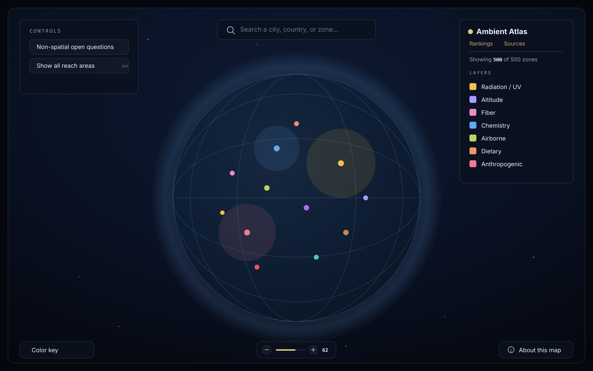

# Ambient Atlas

Ambient Atlas is an interactive 3D globe of around 500 places where the ambient environment shapes human health, from natural radiation, mineral fibres and geochemistry to man-made contamination.

## What it is, and what it isn't

It is an exploratory atlas, not a precise scientific or regulatory instrument. The reach circles, severity and certainty ratings are indicative and meant for orientation, not for risk assessment or any individual decision. What it does promise is provenance: each point is drawn from reliable sources such as peer-reviewed studies and public-health or environmental agencies, and carries citations you can open and check yourself.

## Why and how to use it

Use it to get the lay of the land: where these exposures cluster, how natural and man-made hazards compare, and how settled the science is for each one.

- Spin and zoom the globe; hover a point to preview it, click to read its full sourced entry.
- Filter by category and tier, and weigh how established versus contested each finding is.
- Open any country for a closer view, and pin points to judge how far a place sits from them.

## Technical

- SvelteKit 2 and Svelte 5 (runes), in TypeScript.
- A WebGL globe built with Threlte and three.js: markers, reach fields and country shading rendered in real time.
- d3-geo for projection, country geometry and point-in-polygon lookups.
- Ships as a static single-page app (adapter-static), deployable to any static host.
- The exposure dataset and country metrics are generated by scripts in `scripts/` and live in `src/lib/data`.

## License

Code is licensed under the MIT License ([LICENSE](LICENSE)). The curated dataset is licensed under CC BY 4.0 ([DATA-LICENSE.md](DATA-LICENSE.md)), so reuse requires crediting Ambient Atlas.
